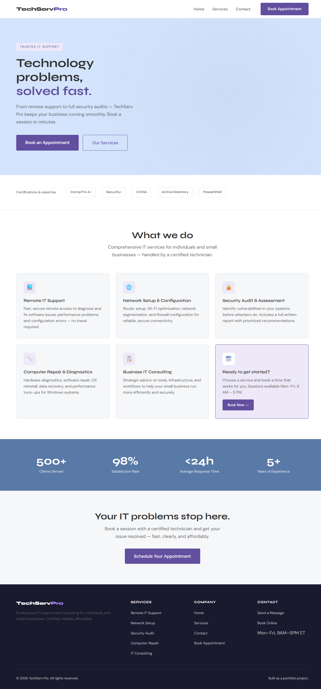
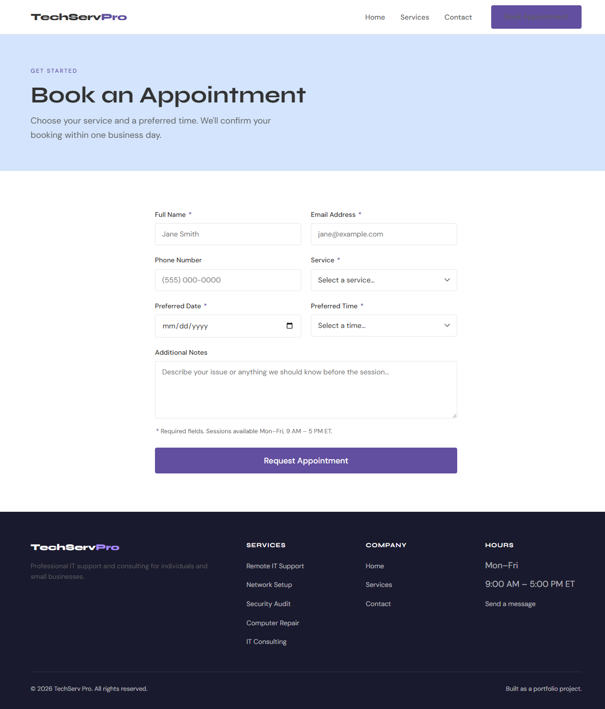
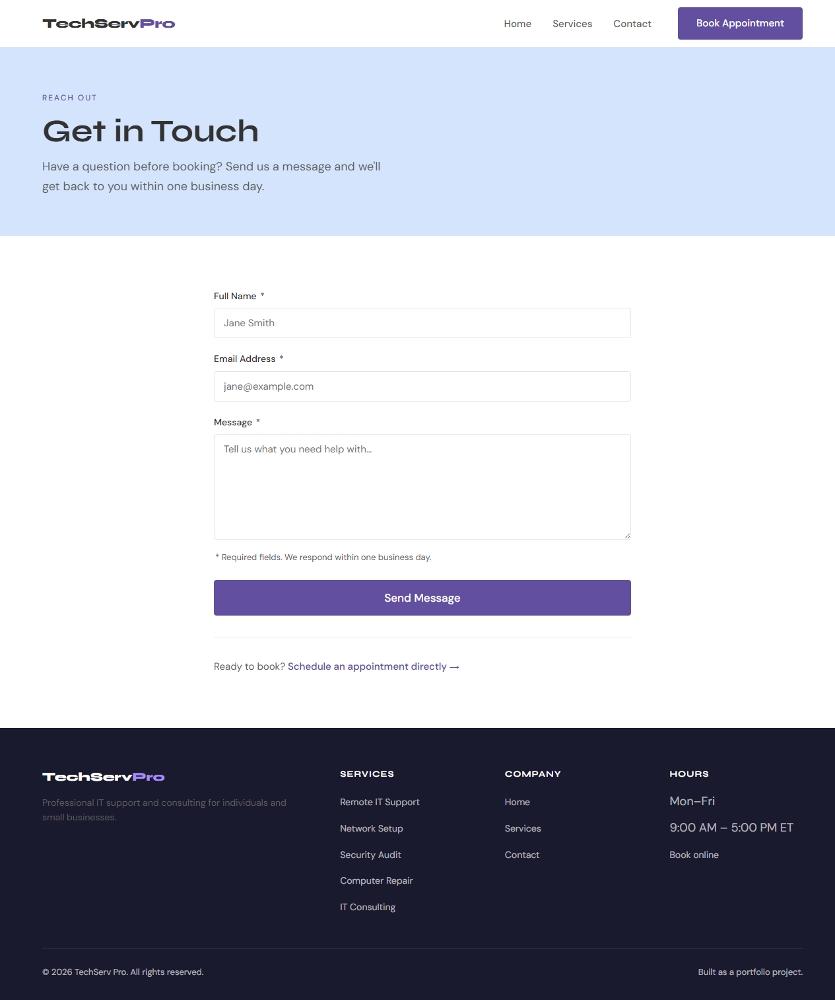
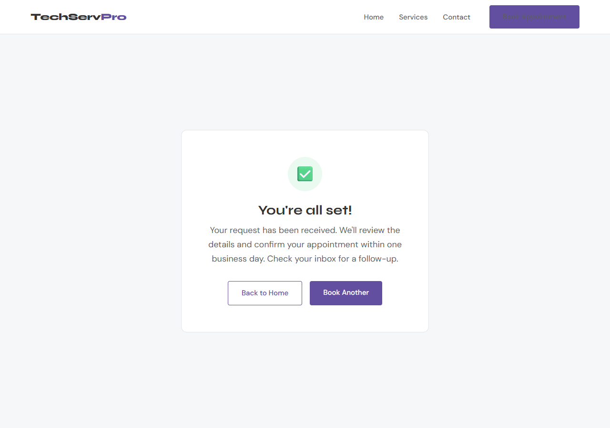

# TechServ Pro

A full-stack appointment booking website for a fictional IT support and consulting business. Built as a portfolio practice project demonstrating a clean Node.js/Express backend, pure HTML/CSS/JS frontend, and end-to-end form handling with validation.

**Live site:** [techserv-pro.onrender.com](https://techserv-pro.onrender.com)

**Live stack:** Node.js · Express · JSON file store · Vanilla HTML/CSS/JS

---

## Screenshots

### Home


### Book an Appointment


### Contact


### Confirmation


---

## Features

- Appointment booking form with service and time slot selection
- Contact message form
- Client-side validation with inline error feedback
- Server-side validation with whitelist checks and input length limits
- Graceful shutdown (SIGTERM/SIGINT)
- JSON file-based data store — no database setup needed
- Responsive layout (mobile, tablet, desktop)

---

## Tech Stack

| Layer | Technology |
|---|---|
| Runtime | Node.js |
| Server | Express 4 |
| Database | JSON flat file (`better-sqlite3`-free, no native builds) |
| Frontend | HTML5, CSS custom properties, Vanilla JS |
| Testing | Playwright MCP (manual QA) |

---

## Setup

```bash
# Install dependencies
npm install

# Start server
node server.js
```

Server runs at `http://localhost:3000`. To use a different port:

```bash
PORT=8080 node server.js
```

---

## API

| Method | Route | Purpose |
|---|---|---|
| `POST` | `/api/contact` | Save a contact message |
| `POST` | `/api/appointments` | Register a new appointment |
| `GET` | `/api/appointments` | List all appointments |

### POST `/api/contact`
```json
{
  "name": "Jane Smith",
  "email": "jane@example.com",
  "message": "I need help with my network setup."
}
```

### POST `/api/appointments`
```json
{
  "name": "Jane Smith",
  "email": "jane@example.com",
  "phone": "(555) 000-0000",
  "service": "Security Audit & Assessment",
  "preferred_date": "2026-05-15",
  "preferred_time": "2:00 PM",
  "notes": "Home lab and network assessment."
}
```

**Valid services:** Remote IT Support, Network Setup & Configuration, Security Audit & Assessment, Computer Repair & Diagnostics, Business IT Consulting

**Valid times:** 9:00 AM – 4:00 PM (hourly slots, Mon–Fri)

---

## Project Structure

```
techserv-pro/
├── server.js           Express app + graceful shutdown
├── database.js         JSON file store (read/write/insert)
├── routes/
│   ├── contact.js      POST /api/contact
│   └── appointments.js POST + GET /api/appointments
└── public/
    ├── index.html      Home page
    ├── book.html       Appointment form
    ├── contact.html    Contact form
    ├── confirmation.html  Success page
    ├── css/styles.css  Design system + responsive layout
    └── js/main.js      Form handlers + fetch calls
```

---

## Code Review Findings

Reviewed with `/code-reviewer` after build. Issues found and fixed before push:

| Severity | Issue | Fix |
|---|---|---|
| Critical | `db.close()` called in shutdown but not exported from `database.js` | Added `close()` export |
| Major | No server-side future-date validation on appointments | Added date comparison guard |
| Major | No input length limits — message/name/notes unbounded | Added max-length checks: name ≤100, message ≤5000, notes ≤2000 |

---

## Design

Inspired by [gohyer.com](https://gohyer.com) — modern minimal with purposeful whitespace.

| Token | Value |
|---|---|
| Primary CTA | `#624F9F` purple |
| Accent bg | `#D3E4FC` light blue |
| Stats bg | `#5979A6` dark blue |
| Body font | Syne (headings) + DM Sans (body) |

---

Built as a portfolio project. No real appointments are accepted.
